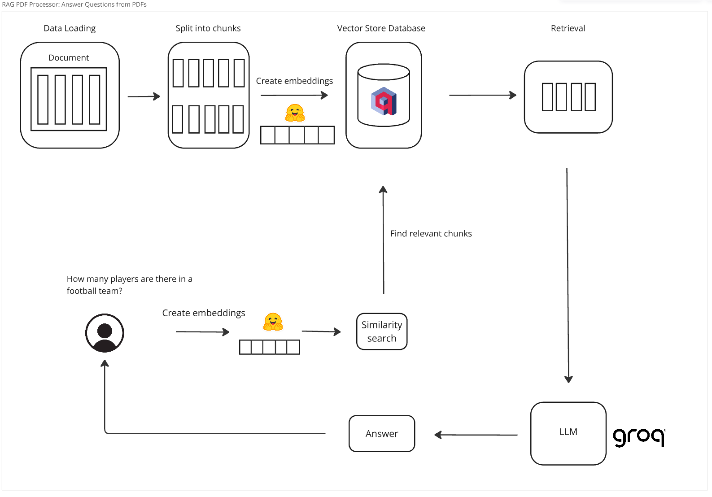

# RAG PDF Reader Application

Welcome to the RAG PDF Chat Application! This application allows users to interactively chat with PDF documents using 
Retrieval-Augmented Generation (RAG) techniques. By leveraging state-of-the-art models and technologies, users can 
explore PDF documents through natural language conversations. This project serves as a complement to the concepts 
discussed in the accompanying [YouTube video](https://youtu.be/6BZUxHLyKLU), offering a practical implementation 
of the discussed techniques.

# Features

- Chat with PDF Documents: Interact with PDF documents using natural language queries.

- Integration with Qdrant: Store and retrieve document vectors using Qdrant as the vector store database.

- Workflow Integration with Langchain: Seamlessly integrate the document processing workflow using Langchain.

- MistralAI Language Model: Leverage the power of the MistralAI language model for conversational interactions.

- Streamlit Frontend: Use Streamlit for building an interactive and user-friendly frontend for the application.

# Installation

To install the RAG PDF Reader application, follow these steps:

Clone the repository:

    git clone https://github.com/Eduardovasquezn/rag-pdf-reader.git

Navigate to the project directory:

    cd rag-pdf-reader

Create and activate virtual environment:

    python -m venv venv
    venv/Scripts/activate

Install the required Python libraries:

    pip install -r requirements.txt

# Usage 

Create a `.env` file using `.env-example` as a template:

    cp .env-example .env

In the `.env` file, insert your [Hugging Face API Key](https://huggingface.co/settings/tokens), [Qdrant API Key](https://qdrant.to/cloud), and [Groq API Key](https://console.groq.com/keys):

    HUGGINGFACEHUB_API_TOKEN=your_token
    QDRANT_HOST=your_token
    QDRANT_API_KEY=your_token
    QDRANT_COLLECTION_NAME=your_collection_name
    GROQ_API_KEY=your_token

Run the main application script:

    streamlit run src/app.py

# Contribution
Contributions to this project are welcome! Feel free to submit bug reports, feature requests, or pull 
requests to help improve the functionality and usability of the RAG PDF Reader application.

# Disclaimer
This application is intended for educational and informational purposes only. 

# Enjoyed Using RAG PDF Reader? Subscribe to My Channel!
If you found the RAG PDF Reader helpful and enjoyed using it, consider subscribing to my 
[YouTube channel](https://www.youtube.com/channel/UCYZ_si4TG801SAuLrNl-v-g?sub_confirmation=1) for more tutorials, 
tips, and projects related to Python, AI, and web development. Your support helps me create more valuable content 
for the community!